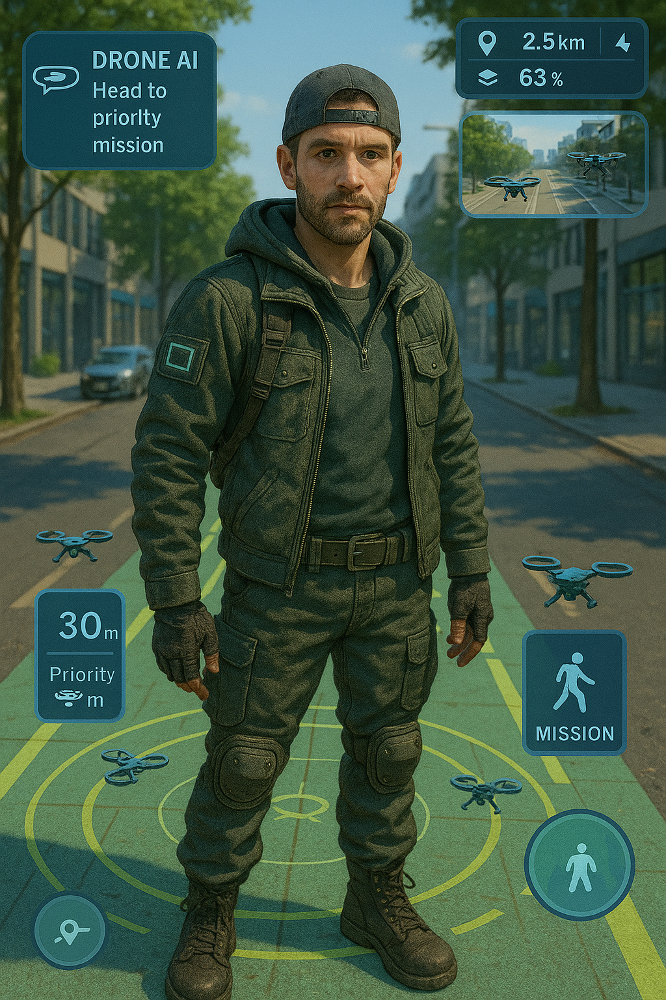

# 🛰️ How CivicWatch Works

CivicWatch transforms civic action into a gamified, blockchain-backed, AI-powered system of real-world missions and rewards. Operators are everyday citizens who take on verified community tasks using drones, AR, and mobile devices—all while earning crypto and building local resilience.

---

## 🎮 Operator Missions Lifecycle

**📍 Report Issue**  
Operators use the CivicWatch AR HUD or drone feeds to identify and tag civic problems (e.g., damage, hazards, crimes, outages).

**🛠️ Submit Solution**  
Operators or community members propose fixes, actions, or reports.

**✅ Verify & Validate**  
Validators confirm authenticity using timestamped photos, videos, and geotags.

**💸 Reward Distribution**  
Smart contracts automatically pay Operators, Validators, and Contributors from the community wallet.

**🔁 Replication & Scaling**  
Operators earn replication bonuses for onboarding new participants.

**📡 Real-Time Engagement**  
Operators live-stream missions. Spectators can donate, vote, or join remotely.

**🧠 Craig AI**  
CivicVerse's AI assistant guides Operators to high-priority missions and suggests actions.

---

## 🧱 Tech Stack Overview

| **Layer**         | **Technologies & Tools**                                      |
|------------------|---------------------------------------------------------------|
| **Frontend**      | React Native (mobile), React.js (web), AR.js / WebXR         |
| **Backend**       | Node.js (Express/Fastify), Python (FastAPI for AI logic)     |
| **Database**      | PostgreSQL / MongoDB / IPFS (for decentralized storage)      |
| **Blockchain**    | Monero (mining layer), Kaspa, Bitcoin, Ethereum smart contracts |
| **P2P Mesh**      | LoRaWAN, Bluetooth Mesh, IPFS, libp2p                        |
| **AI Assistant**  | Python ML models, GPT APIs, mission-prioritization logic     |
| **Streaming**     | WebRTC, RTMP, decentralized video (Livepeer, etc)            |
| **Authentication**| Decentralized IDs (DIDs), Soulbound NFTs, OAuth fallback     |

---

## 💰 Payout & Reward Flow

### 🧨 Mining Pool Rewards
- Mining nodes generate cryptocurrency: Monero, Kaspa, Bitcoin, and Ethereum.
- A portion is reserved for CivicWatch mission payouts.

### 🧾 Microtax Contributions
- A 1% microtax on all CivicVerse transactions is directed into a **community wallet** that funds CivicWatch operations.

### 🎯 Mission Completion Rewards
- Operators receive **base payouts** for verified problem reports.
- **Additional bounties** are awarded for submitted solutions and validated results.
- **Validators** earn staking rewards for confirming mission authenticity.

### 💸 Donations & Tips
- Spectators can tip Operators or donate to specific live-streamed missions.
- Funding supports drone usage, tools, or emergency resources.

### ⚙️ Automatic Distribution
- Transparent, on-chain **smart contracts** handle payments.
- Operators and Validators track earnings via dashboards and blockchain explorers.


---

## 🚀 Getting Started

1. Clone the CivicVerse repo:
   ```bash
   git clone https://github.com/Civicverse/Civicverse.git
   cd civicverse

   Install backend and frontend dependencies.

Start backend services including the AI assistant (Craig).

Run frontend apps:

CivicWatch Operator Mode (for field users)

Spectator Mode (for remote donors and viewers)

Deploy Ethereum-based smart contracts (mainnet or testnet).

Optionally join a local mesh network (LoRaWAN, Bluetooth) for offline mission support.

🧠 Summary
CivicWatch is a real-world civic action engine built for post-collapse readiness and decentralized collaboration.

Backed by blockchain.

Guided by AI.

Powered by citizens.

From identifying potholes to patrolling neighborhoods during crises, CivicWatch rewards real-world impact with real crypto—and builds a culture of trust, action, and local power.

👁️ Be the eyes, ears, and heart of your community.

📡 Stream the truth.
💥 Earn for impact.
🛠️ Help build a better world.
